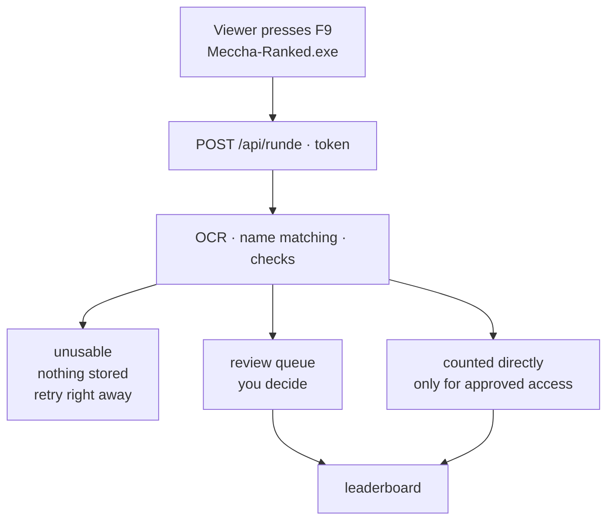

# Meccha Ranked

*[Deutsche Fassung](README.md)*

A leaderboard for **MECCHA CHAMELEON** streams. Viewers press `F9` after a round, the
server reads the scores from the screenshot and records them.



The game has no API, no web leaderboard and no export. The scores exist only on
screen — hence OCR, and hence a human looks at every submission before it counts.

---

## The rules

| | |
|---|---|
| What counts | the **average of your last 10** rounds |
| Ranked from | **10** rounds — before that you are a contender: visible with an average, without a place |
| Scored by | **in-game points**, not placement |
| A round counts from | **6 hiders** on the scoreboard |
| Scored places | **rank 1–15** |
| Pause afterwards | **3 minutes** — or **30 seconds** if the round could not be used |

The scoreboard lists only **hiders**, never hunters. A lobby holds up to 24 people and
the number of hunters varies, so roughly 6 to 20 rows end up in the image.

**On the verge:** contenders whose average would reach the top three also appear at
the very top — from 5 rounds on. Otherwise the best newcomer would sit at the bottom
of a list they actually lead.

All of these are constants in the code. The rules page at `/regeln` **generates itself
from them** — it cannot claim something the server does not do.

---

## Who takes part

The player list is the set of **registered Steam accounts**. If you are not signed in,
you are not scored — that is the rule, not a shortcoming.

Steam's OpenID needs neither registration nor an API key: no password, no email
address, no confirmation mail. Meccha runs through Steam anyway, so every player
already has an account.

Three rules hang on the **in-game name**, all for the same reason — otherwise someone
could claim the top player's row:

- **Unique** across all accounts. First come, first served.
- Changeable only every **30 days** (`MC_NAMENSSPERRE_TAGE`).
- Any change by the user resets their access to "needs review".

---

## The reader

**No AI and no graphics card** — RapidOCR via Python. This works because of three
properties of the game: the text is white, red or green (a colour filter instead of a
brightness threshold), the **columns are fixed** (names and scores are read as
separate strips), and the **rows are fixed** (matched by Y coordinate).

| | RapidOCR | Vision model |
|---|---|---|
| Scores correct | **10 of 10** | 10 of 10 |
| Time | **3 s** | 94 s |
| Graphics card | **none** | 12 GB VRAM |

The vision model remains as a fallback: `set MC_LESER=ollama`. It needs no geometry and
helps if the game ever changes its layout.

### Read twice, because once is not enough

The score column is read **twice**, at different magnifications.

The trigger was a real case: `995` became `566`. Not because of the colour filter — in
the filtered image `995` was perfectly legible — but because OCR misread the small
pixel font. And no single setting reads everything correctly:

```
scale 4:  995 → 566 wrong,   1 130 right
scale 8:  995 → 995 right,   1 130 disappears entirely
```

This does not fix the misreading — it makes it **visible**. Where both passes agree,
the number is solid. Where they disagree, the reader returns `995?566` instead of a
number: parsing fails, the row becomes a query, and the review card shows both
candidates side by side.

**This is the most dangerous kind of error in the project.** A `566` is a perfectly
plausible score — no garbled characters, no substitution, nothing a check could hold
on to.

### When someone leaves mid-match

If a player leaves, their **name** disappears from the scoreboard — their **score**
stays. Seven participants become three readable names and seven numbers.

A score without a name **is** a participant. It gets the placeholder `?` and counts
towards the minimum. It can be credited to nobody — and that is right: the round
counts, the row does not.

### Never scale down

| Scaling | Baloou | Albert Wesker's Balls |
|---|---|---|
| **100 %** | `2 614` ✓ | `587` ✓ |
| 60 % | `2 514` ✗ | `567` ✗ |
| 45 % | `2 564` ✗ | `587` ✓ |

The numbers tip over quietly. `2 514` instead of `2 614` looks plausible and slips
past every check.

---

## Name matching

The most delicate part. `ordneZu()` compares the name that was read against the
in-game names of the accounts, in three stages:

| Stage | What happens | Example | Confidence |
|---|---|---|---|
| 1 | `nameKey` match | `NORIKOTV` → `NorikoTv` | 1.0 |
| 2 | equal once decoration is stripped | `theRealBaloou!` → `theRealBaloou` | 0.95 |
| 3 | Levenshtein, only on a unique hit | `N0rikoTv` → `NorikoTv` | 0.85 / 0.7 |
| — | several equally close candidates | → **query** | — |
| — | nobody close enough | → **query** | — |

How much deviation is allowed depends on length — what matters is the proportion:

| Length | Allowed distance | Why |
|---|---|---|
| ≤ 4 | **0** | `Tom` and `Tim` are 1 apart and are different people |
| 5–8 | 1 | one misread character |
| ≥ 9 | 2 | one `l`/`1` plus one `O`/`0` |

### When a row is held back

A row is recorded only if **both name and score** are certain. A certain name with a
guessed number is just as useless as the other way round.

| Case | Behaviour |
|---|---|
| Score unreadable | query |
| Score only via character substitution (`1O579`) | query, even with an exact name |
| Leading zero (`0387`) | query — for a score that is a misreading |
| Name unknown or ambiguous | query |
| **two rows point at the same person** | **both** become queries |

The last one is the least conspicuous and the most important: in a lobby everyone
appears exactly once. If two rows point at the same person, one of them was misread —
and someone would get a stranger's score in their average.

---

## Anti-cheat

Four hurdles stacked. Each catches something the others let through:

| Hurdle | Catches | Does **not** catch |
|---|---|---|
| Image hash | the same file again | re-saved |
| Image check (PNG chunks) | edited in an image editor | a different capture tool |
| Match fingerprint | the same lobby round again, even from someone else | if the other players' rows differ |
| **Suspicion** | genuine rounds, but the own row always forged to the same value | the one-off outlier |

The fourth is the one against the patient cheater: they play real rounds with
different players but forge their own row to the same value every time. Every match
fingerprint differs, every image is freshly captured, every hash is new — and still
exactly `11 714` appears three times in the list.

**From 1000 points, looking back 30 days.** Below that, values repeat honestly.

**No automation decides.** A flag makes sure the round lands with you instead of
passing through, and that the evidence is kept. An automation that locks out honest
people would be worse than the cheating it prevents.

---

## Several leaderboards

Several can run at once, for instance one for the year and one for the month. An
approved round is added to **every active one** — one F9, two entries.

A new list starts from zero. Deactivating means **hiding**: it stops accepting entries
and disappears from the public page, but stays in the dashboard and can be switched
back on. The last active list cannot be deactivated — otherwise there would be a state
where approved rounds land nowhere, and "added to zero lists" looks just like "added".

Creating and deactivating is **admin only**: an accidentally created list doubles every
round from then on. CSV export per list.

---

## The images

| | Size | Retention |
|---|---|---|
| **Crop** (leaderboard block, JPEG) | ~55 KB | **permanent** |
| Original (full screen, PNG) | ~2 MB | 3 days |
| Original of a flagged round | ~2 MB | 30 days |

Do not scale down — **crop**. The block sits at a fixed position; cropped at full
resolution it is 57 KB instead of 4.7 MB: eighty times smaller, and every digit stays
sharp.

Side effect: the rest of the screen is gone. On a full screenshot you otherwise
sometimes see Discord messages or other people's open browser tabs.

---

## Four languages

German, English, Chinese, Japanese — on every player-facing surface:

```
Client          81 strings
Account page   114
Rules page      41
```

The **German sentence is the key**, English is the default. If a translation is
missing, German text appears — an empty slot would be worse than a sentence in the
wrong language. Tests make sure no language has gaps.

The dashboard is not translated: only admins and mods ever see it.

---

## Running your own

The server is the real thing: accounts, rounds and leaderboards live there, the reader
runs there, the website is served from there. Setting it up: [UMZUG.md](UMZUG.md)
(German). Deploying later: `./deploy.sh`, which runs on the server.

For **development and trying things out**, the same runs locally:

```
npm install
copy EINSTELLUNGEN.bat.beispiel EINSTELLUNGEN.bat
```

Then open `EINSTELLUNGEN.bat` and set `MC_ADMIN_KEY`. The reader needs Python with
RapidOCR — see [python/README.md](python/README.md). Start with `MECCHA-START.bat`,
which opens the server and the dashboard.

**Test data:** `npm run testdaten` creates ten accounts with varying numbers of rounds
— five ranked, two on the verge, three contenders. `-- --weg` removes them again.

### The watcher — local only

`WACHE.bat` reads your own screen on a keypress and writes **straight into the `daten/`
folder next to it**. It never talks to the server; what it writes is visible only to
whoever has that hard drive.

So it is a tool for trying things out, not a way into the live leaderboard — the only
road there is `POST /api/runde` from the client. It dates from the time when everything
ran on one machine.

For measuring it is still the best thing available: `WACHE-PROBE.bat` records nothing
but shows what the reader makes of the image, and drops the PNG into
`%TEMP%\mc-ranked-bilder\`. That is exactly how this project's misreadings were found.

The hotkey uses `GetAsyncKeyState`, not `RegisterHotKey` — the key is only *watched*,
not claimed. That is why `F9` works while the game is in the foreground, and the game
still receives it.

---

## The viewer client

A single file, `Meccha-Ranked.exe` from `client-cs/` — around 66 KB, no installation,
built against .NET Framework 4.

Two things are deliberately fixed:

**The server address is baked into the .exe** and is neither shown nor read from a
file. Nobody should send their rounds somewhere else by accident. A server move
therefore means a new .exe, not a request to everyone to edit a line.

**The token cannot be deleted by accident.** Once one is entered, the field shows only
`WAA5••••••••FOCc`, locked and greyed out. Changing it goes through a separate button
with a confirmation that defaults to "no".

The client shows **who you are** (`In game: Baloou`), reports **what became of your
round**, and lets every round be **expanded** — name as read, lobby size, your rank,
timestamps, rejection reason.

**A fixed place instead of `Meccha-Ranked (3).exe`.** A browser cannot overwrite a
file, it appends a number — after the third version three programs lie around and
nobody knows which one is running. On start the client therefore offers to copy itself
to `%LOCALAPPDATA%\Meccha Ranked\` and run from there; if a version is already there,
it is replaced. So downloading a new `.exe` is what retires the old one. **Nothing** is
fetched over the network for this — that would be exactly the behaviour antivirus
heuristics flag.

**Where the file lives:** on **GitHub**, as a release, next to the source — not on the
server. The server only points there; `/client` redirects, so old links from Discord
do not dead-end. The reason is not technical: nobody trusts an unknown domain, an open
repository with readable source rather more.

**Building:** `client-cs\BAUEN.bat`. The version number lives in
`config/verteilung.json` and is written into the .exe at build time — the server
reports the same number, and anyone on an older one sees the notice along with the way
to the download.

That is why the build **aborts** if the sources changed and `clientVersion` did not:
otherwise two different .exe files carry the same name, the notice never appears, and
nobody can tell from their file which one they have. Exactly that happened when the
client gained Japanese and stayed at 0.5.0.

It is said in three places: in the client as a yellow box above the list that opens the
download page; under the download button as the **version plus build date**; and — once
someone has submitted at all — as a comparison with **their** version, because from
0.7.0 on the client sends it with every request.

---

## The download warning

Chrome says "not commonly downloaded", Windows says "Windows protected your PC" on
first launch. Two different warnings at two different moments, both for the same
reason: the file is **unknown**. No signature, no reputation.

The only real fix is a code-signing certificate for several hundred euros a year — and
this project is meant to cost nothing. So, the honest route: `/download` **shows** the
warning and explains it, rather than hiding it.

Plus three ways to check for yourself, none of which asks you to trust anybody:
compare the **checksum** from the release notes with `Get-FileHash`, have the file
**checked by VirusTotal**, or **read the source and build it yourself**.

That a few scanners will flag it is said up front. Seven out of seventy report
"trojan" — all heuristics: the program is new, unsigned, takes screenshots and sends
them over the network. Send someone to VirusTotal unwarned and they come back more
suspicious than they left.

---

## Tests

```
npm test        725 tests
npm run build   type check
```

No dependency on a running server — integration tests spin up their own on a free
port. Steam is never actually contacted: the callback is extracted as a parameter.

**The display is executed, not read.** `test/hilfe-dom.ts` is a tiny fake DOM — the
account page really runs inside it, with faked server responses. The reason: twice the
leaderboard failed on a runtime error that the `catch` swallowed, and no test noticed.
Tests that grep the source check *that* something is there, not whether it works.

---

## Files

| File | Purpose |
|---|---|
| `src/rangliste.ts` | The scoring: average of the last 10, placement |
| `src/listen.ts` | Several leaderboards side by side |
| `src/wertung.ts` | The bracket between accounts and leaderboard |
| `src/namen.ts` | Normalisation, Levenshtein, matching |
| `src/parse.ts` | OCR text → name + score, separators, substitutions |
| `src/runde.ts` | Decision per row: record or query |
| `src/leser.ts` | Validate the reader's answer before it triggers anything |
| `src/rapidocr.ts` · `src/ollama.ts` | The two readers |
| `src/ausschnitt.ts` | Crop the leaderboard block |
| `src/bildpruefung.ts` | Does the image look like a fresh capture? |
| `src/verdacht.ts` | The same score yet again |
| `src/freigabe.ts` · `src/freigabe-api.ts` | Review queue and dashboard endpoints |
| `src/konten.ts` · `src/steam.ts` | Accounts, sessions, Steam sign-in |
| `src/konto-seite.ts` | Leaderboard and account page |
| `src/regeln-seite.ts` · `src/download-seite.ts` | `/regeln` and `/download` |
| `src/rechtliches-seite.ts` | Legal notice and privacy policy |
| `src/tokens.ts` | Upload tokens, minimum interval |
| `src/server.ts` | The server: uploads, pages, redirects |
| `client-cs/` | Viewer client in C# |
| `python/lies_rangliste.py` | The RapidOCR part |
| `UMZUG.md` | Server setup (German) |
| `UMBAU.md` | How an add-on became a standalone system (German) |
| `bugfest.md` | Reported bugs, what was behind them, what stayed open (German) |

---

## The thresholds in the code are defaults

The anti-cheat is out in the open — deliberately. A check that only works while
nobody knows about it is not a check.

Its **numbers**, however, are configurable, and in production they differ:

| | |
|---|---|
| `MC_VERDACHT_AB` | the score from which a repeat stands out |
| `MC_VERDACHT_TAGE` | how far back to look |
| `MC_MIN_SPIELER` | minimum number of hiders |
| `MC_ABSTAND_ANGENOMMEN` · `MC_ABSTAND_FEHLSCHLAG` | the cooldowns |

So reading `1000` and `30` here does not tell you where the bar actually sits.

---

## Licence

MIT — see [LICENSE](LICENSE). Take it, change it, run your own leaderboard.

MECCHA CHAMELEON belongs to its respective owners. This project is not affiliated
with the developers of the game, nor with Valve, Steam, Twitch or Discord.
